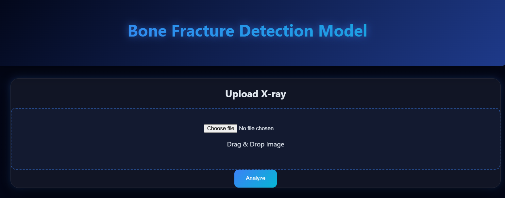

# 🦴 Bone Fracture Detection & Classification using Vision Transformer

An AI-powered medical imaging system that detects bone fractures and classifies fracture types from X-ray images using deep learning.

🏆 **Achievement:** 2nd Runner-Up — HackBio (Xpecto’26), IIT Mandi

---

# 📌 Project Overview

Bone fractures are commonly diagnosed through X-ray analysis by radiologists. However, manual diagnosis can be time-consuming and requires expert expertise.

This project presents a **deep learning-based fracture detection system** that:

✔ Detects whether a fracture exists
✔ Classifies fracture types (12 categories)
✔ Generates an AI-based diagnostic report

💡 **Impact:** Helps reduce manual workload and supports faster medical decision-making.

---

# 🚀 Key Features

* ✔ Binary fracture detection (Fractured / Not Fractured)
* ✔ Multi-class fracture classification (12 types)
* ✔ Vision Transformer (ViT-Small Patch16 224)
* ✔ AI-generated radiology report
* ✔ Confidence score output
* ✔ Fast inference (~14 ms per image)
* ✔ Clean modular pipeline
* ✔ Frontend using HTML, CSS, JavaScript

---

# 📸 Demo


---

# 🧠 Model Architecture

The system uses:

👉 **Vision Transformer (ViT-Small Patch16 224)**
👉 Trained from scratch (no fracture-pretrained models)

### Why ViT?

* Captures global image relationships
* Handles complex medical patterns
* Modern deep learning approach

---

# 🔄 System Pipeline

```bash
X-ray Image Input (User Upload / Test)
        ↓
Image Preprocessing (Resize 224×224 → Tensor)
        ↓
Stage 1: Fracture Detection (ViT)
        ↓
If Not Fractured → Stop
        ↓
Stage 2: Fracture Type Classification (ViT)
        ↓
Predicted Fracture Type + Confidence
        ↓
AI Diagnosis Report
```

---

# 📂 Project Structure

```bash
BONE_FRACTURE_AI/

├── dataset/                 # Binary dataset
├── dataset_types/           # Multi-class dataset

├── models/
│   ├── binary_model.pth
│   └── type_model.pth

├── Frontend/                # HTML/CSS/JS UI

├── model.py                 # ViT model
├── train.py                 # Training script
├── evaluate.py              # Evaluation metrics
├── predict.py               # Basic prediction
├── predict_pipeline.py      # Full pipeline
├── data_loader.py           # Data preprocessing

├── config.yaml
├── requirements.txt
├── README.md
```

---

# 📊 Model Performance

## 🟢 Binary Fracture Detection

| Metric        | Value      |
| ------------- | ---------- |
| Accuracy      | **91.23%** |
| Precision     | **91.94%** |
| Recall        | **90.90%** |
| F1 Score      | **91.12%** |
| Test Accuracy | **97.66%** |

✔ Excellent generalization
✔ Very low false positives

---

## 🔵 Fracture Type Classification

| Metric              | Value      |
| ------------------- | ---------- |
| Validation Accuracy | **86.56%** |
| Test Accuracy       | **84.49%** |

✔ Good classification performance
⚠ Slight overfitting observed

---

## ⚡ Inference Speed

~14 ms per image

---

# 🦴 Supported Fracture Types

* Avulsion
* Comminuted
* Compression
* Fracture
* Greenstick
* Hairline
* Impacted
* Intra-articular
* Longitudinal
* Oblique
* Pathological
* Spiral

---

# ⚙️ Training Configuration

| Parameter     | Value            |
| ------------- | ---------------- |
| Batch Size    | 32               |
| Epochs        | 15               |
| Learning Rate | 0.0001           |
| Optimizer     | Adam             |
| Loss Function | CrossEntropyLoss |
| Image Size    | 224×224          |

---

# 📈 Evaluation Metrics

* Accuracy
* Precision
* Recall
* F1 Score
* Macro F1 Score
* Confusion Matrix
* AUC-ROC
* Cross-validation

📁 Outputs stored in:

* `final_results.csv`
* `model_performance_analysis.csv`

---

# 📂 Dataset

This project uses publicly available datasets:

* https://www.kaggle.com/datasets/amohankumar/bone-break-classifier-dataset
* https://www.kaggle.com/datasets/bmadushanirodrigo/fracture-multi-region-x-ray-data

⚠ Dataset is not included due to size limitations.

---

# 💻 Installation

```bash
git clone https://github.com/YOUR_USERNAME/bone-fracture-ai.git
cd bone-fracture-ai
pip install -r requirements.txt
```

---

# ▶️ Run Project

## Run Backend

```bash
python predict_pipeline.py
```

## Run Frontend

Open the `Frontend/index.html` file in your browser.

---

# 📄 Sample Output

```bash
AI RADIOLOGY REPORT

Result: Fracture Detected
Confidence: 99.96%

Fracture Type: Pathological
Type Confidence: 35.67%

Recommendation:
Consult an orthopedic specialist
```

---

# 🏥 Applications

* Medical decision support
* Radiology assistance
* Remote healthcare diagnostics
* Medical education

---

# ⚠️ Limitations

* Depends on dataset quality
* Similar fracture types may confuse model
* Not a replacement for professional diagnosis

---

# 🔮 Future Improvements

* Larger datasets
* Explainable AI (Grad-CAM)
* Mobile app deployment
* Hospital integration

---

# 👨‍💻 Author

**Sukhraj Singh**
AI / Machine Learning Developer

---

# 📜 License

This project is for educational and research purposes only.
